

  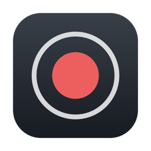

<h1 align="center">Mac-Monologue</h1>

  <b>Record yourself - or your screen, with you in the corner.</b> 
  Press one key, talk, press it again. Your video is ready. No editing afterwards.

  <picture>
    <source media="(prefers-color-scheme: dark)" srcset="docs/images/hero-dark.png">
    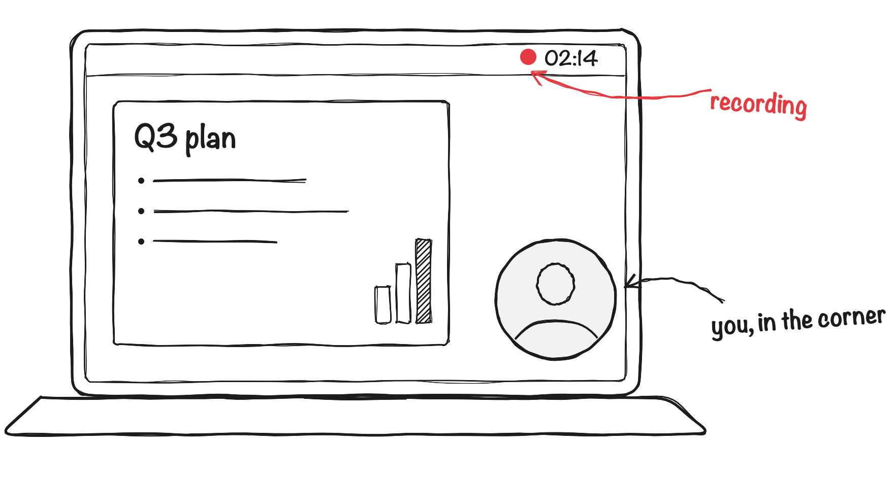
  </picture>

  <a href="https://github.com/alexanderpuschkinberlin/Mac-Monologue/releases/latest/download/Mac-Monologue.zip">
    <picture>
      <source media="(prefers-color-scheme: dark)" srcset="docs/images/download-dark.png">
      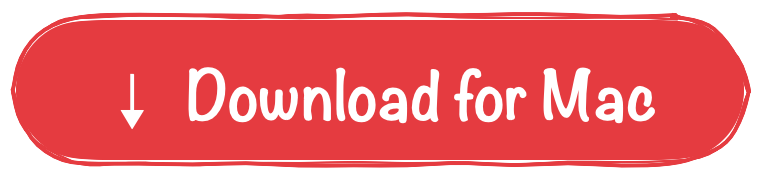
    </picture>
  </a>

  Free · Apple Silicon · macOS 15 or later · <a href="#install">How to install</a> 
  A fork of <a href="https://github.com/omacom/monologue">omacom/monologue</a> by David Heinemeier Hansson, rebuilt for the Mac.

 

<h2 align="center">As simple as it gets</h2>

<table>
  <tr>
    <td width="33%" align="center">
      <picture>
        <source media="(prefers-color-scheme: dark)" srcset="docs/images/step-mode-dark.png">
        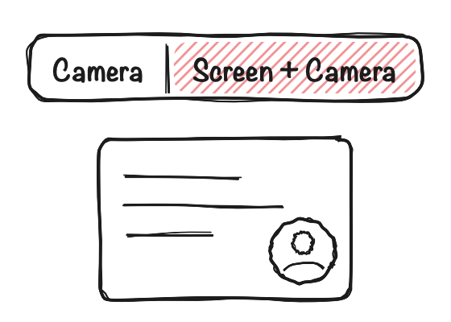
      </picture>
      <h3>1 · Choose</h3>
      
Just the camera, just your screen, or your screen with you in a corner - or let the trackpad cut between them.

    </td>
    <td width="33%" align="center">
      <picture>
        <source media="(prefers-color-scheme: dark)" srcset="docs/images/step-press-dark.png">
        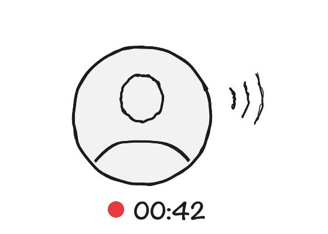
      </picture>
      <h3>2 · Talk</h3>
      
Press <kbd>⌃</kbd><kbd>⌥</kbd><kbd>⌘</kbd><kbd>R</kbd> to start and to pause - from any app.

    </td>
    <td width="33%" align="center">
      <picture>
        <source media="(prefers-color-scheme: dark)" srcset="docs/images/step-share-dark.png">
        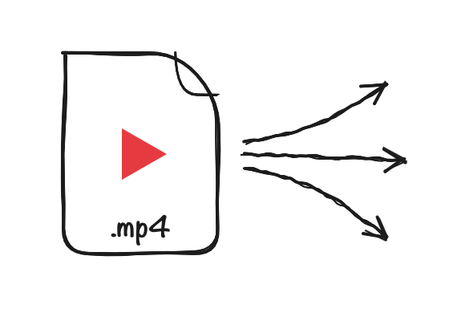
      </picture>
      <h3>3 · Share</h3>
      
Finish, and the video is waiting in your Movies folder.

    </td>
  </tr>
</table>

 

<h2 align="center">What it does</h2>

<table>
  <tr>
    <td width="50%">
      <picture>
        <source media="(prefers-color-scheme: dark)" srcset="docs/images/corners-dark.png">
        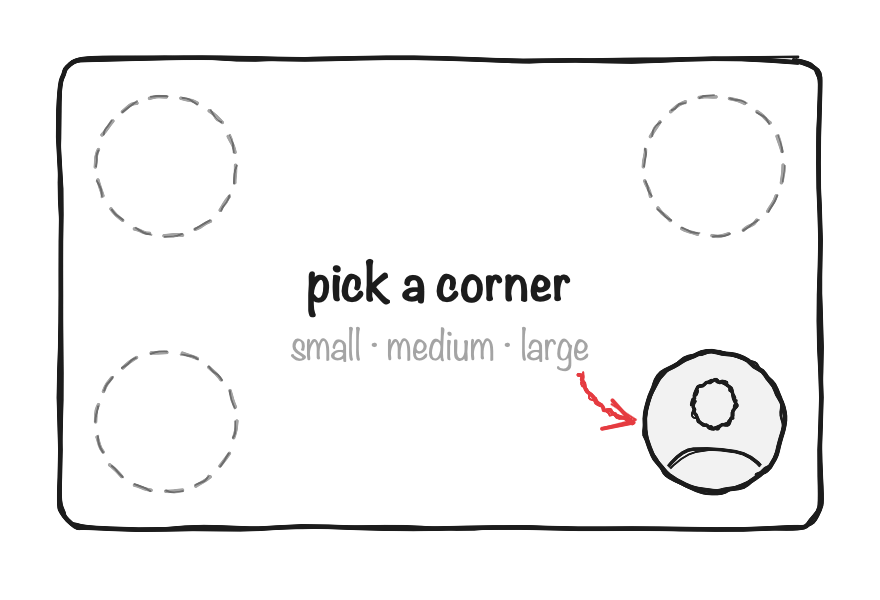
      </picture>
    </td>
    <td width="50%">
      <h3>You, in the corner</h3>
      
Record a presentation or a demo with yourself in a round bubble - the look of the tutorials you know, without putting it together afterwards. Pick one of four corners and one of three sizes; the preview shows exactly what gets recorded. Or record just the screen, without the bubble.

    </td>
  </tr>
  <tr>
    <td width="50%">
      <h3>Cut to yourself with one finger</h3>
      
Choose <b>Screen &amp; Head Touch Cut</b>. While a finger rests on the trackpad, your screen fills the picture, with you in the corner. Let go, and a moment later the video cuts to you, full frame - the look of an edited video, straight out of the recording. Works with the trackpad; with a mouse it records like Screen + Camera.

    </td>
    <td width="50%">
      <picture>
        <source media="(prefers-color-scheme: dark)" srcset="docs/images/touch-cut-dark.png">
        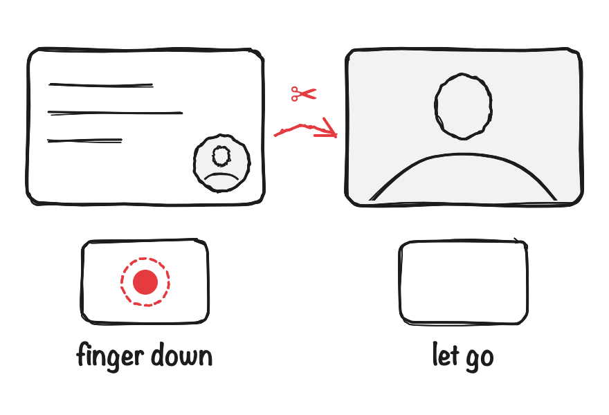
      </picture>
    </td>
  </tr>
  <tr>
    <td width="50%">
      <picture>
        <source media="(prefers-color-scheme: dark)" srcset="docs/images/countdown-dark.png">
        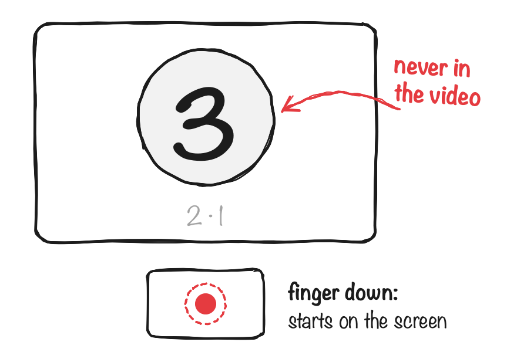
      </picture>
    </td>
    <td width="50%">
      <h3>A moment to get ready</h3>
      
Press record, and 3 - 2 - 1 counts down in the middle of your screen - never in the video. In Touch Cut it is where you choose how the take opens: finger on the trackpad, and it starts on your screen. Press again to cancel. Three seconds, five, ten, or off - in Settings.

    </td>
  </tr>
  <tr>
    <td width="50%">
      <h3>Pick the screen you record</h3>
      
More than one screen on your Mac? Choose which one gets recorded - your slides on the big display, while your notes stay on the laptop, out of the video.

    </td>
    <td width="50%">
      <picture>
        <source media="(prefers-color-scheme: dark)" srcset="docs/images/screens-dark.png">
        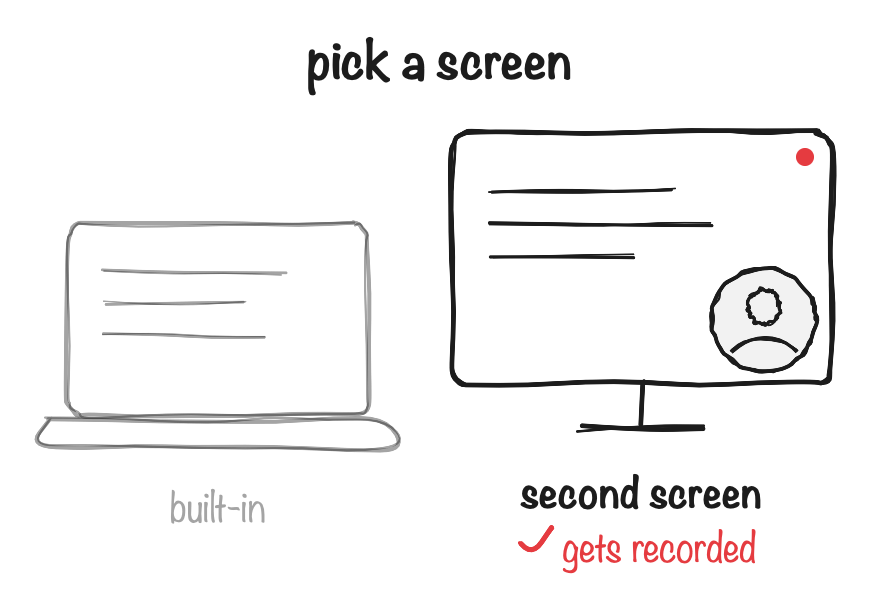
      </picture>
    </td>
  </tr>
  <tr>
    <td width="50%">
      <picture>
        <source media="(prefers-color-scheme: dark)" srcset="docs/images/iphone-camera-dark.png">
        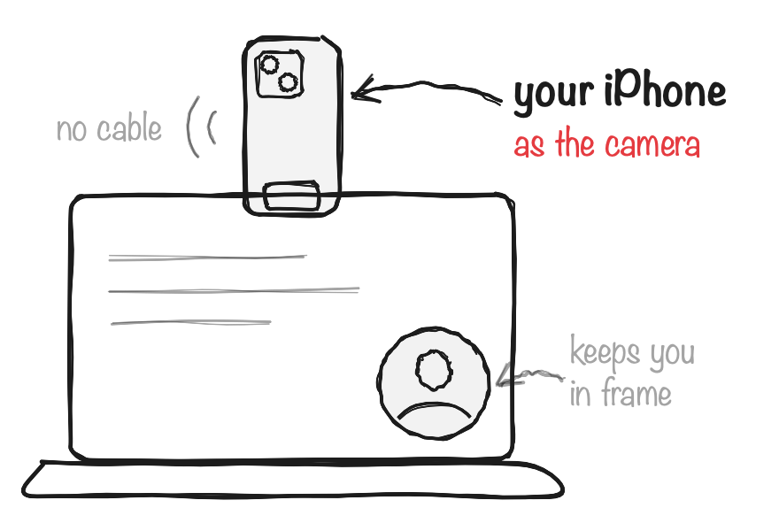
      </picture>
    </td>
    <td width="50%">
      <h3>Your iPhone as a camera</h3>
      
Clip your iPhone to the top of your Mac and pick it as the camera: a far sharper picture, no cable, nothing to install on the phone. Hold it upright or sideways, and the video is always the right way up. Turn on <b>Keep me in frame</b>, and Center Stage follows you as you move.

    </td>
  </tr>
  <tr>
    <td width="50%">
      <h3>Pause without dead air</h3>
      
Lost your thread? Pause, think, carry on. The pause is cut out, and one continuous video comes out - no stitching, no silent gaps.

    </td>
    <td width="50%">
      <picture>
        <source media="(prefers-color-scheme: dark)" srcset="docs/images/pause-dark.png">
        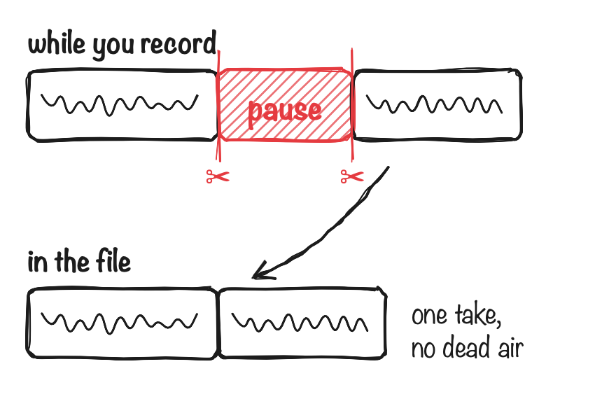
      </picture>
    </td>
  </tr>
  <tr>
    <td width="50%">
      <picture>
        <source media="(prefers-color-scheme: dark)" srcset="docs/images/keys-dark.png">
        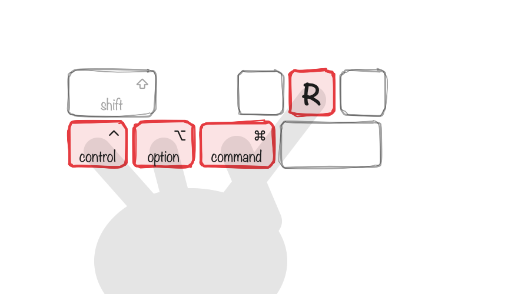
      </picture>
    </td>
    <td width="50%">
      <h3>Control it from anywhere</h3>
      
While you present, your slides are in front. <kbd>⌃</kbd><kbd>⌥</kbd><kbd>⌘</kbd><kbd>R</kbd> still starts and pauses, <kbd>⌃</kbd><kbd>⌥</kbd><kbd>⌘</kbd><kbd>↩</kbd> finishes - and a red dot in the menu bar shows the time running. The window gets out of your way.

    </td>
  </tr>
  <tr>
    <td width="50%">
      <h3>Your voice and your Mac, together</h3>
      
Play a video or music during your presentation, and it is in the recording along with what you say - in one track, in sync. One fader sets the balance, like a DJ's between two decks: slide towards your voice and the video gets quieter, towards the Mac and your voice does - even while you record. Or let it duck: the Mac gets quieter whenever you speak.

    </td>
    <td width="50%">
      <picture>
        <source media="(prefers-color-scheme: dark)" srcset="docs/images/audio-dark.png">
        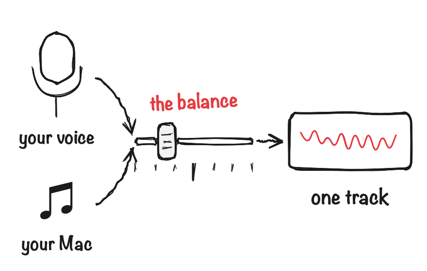
      </picture>
    </td>
  </tr>
  <tr>
    <td width="50%">
      <picture>
        <source media="(prefers-color-scheme: dark)" srcset="docs/images/subtitles-dark.png">
        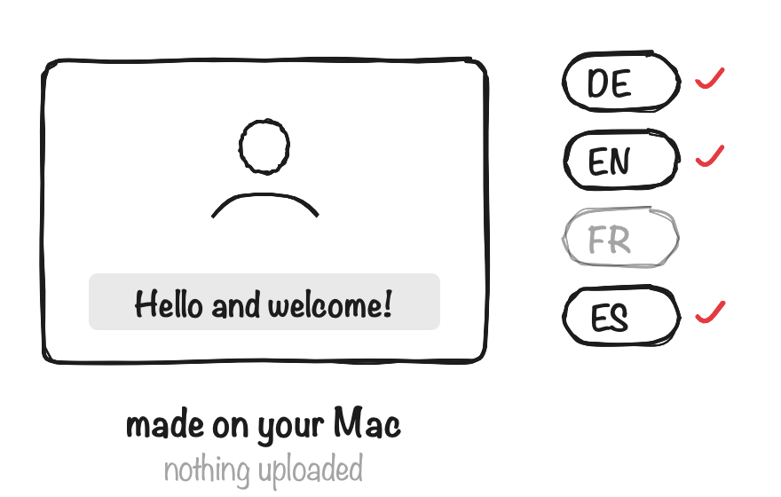
      </picture>
    </td>
    <td width="50%">
      <h3>Subtitles in four languages</h3>
      
After each take, your Mac writes down what you said and adds it as subtitles: in the language you speak, and translated into German, English, French or Spanish, whichever you choose. Viewers switch them on in their player, and each language is also saved as a file for YouTube or Vimeo. All of it happens on your Mac, with its own tools. Needs macOS 26 or later.

    </td>
  </tr>
  <tr>
    <td width="50%">
      <h3>Looks like a mirror, reads the right way</h3>
      
The preview behaves like a mirror, so moving around feels natural. The video shows you the way others see you - so a sign you hold up reads correctly. Prefer it mirrored? One checkbox.

    </td>
    <td width="50%">
      <picture>
        <source media="(prefers-color-scheme: dark)" srcset="docs/images/mirror-dark.png">
        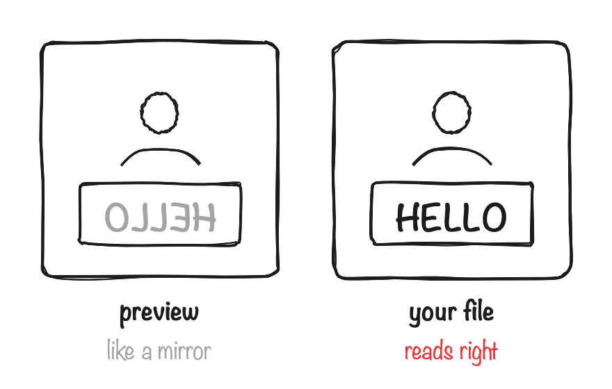
      </picture>
    </td>
  </tr>
  <tr>
    <td width="50%">
      <picture>
        <source media="(prefers-color-scheme: dark)" srcset="docs/images/privacy-dark.png">
        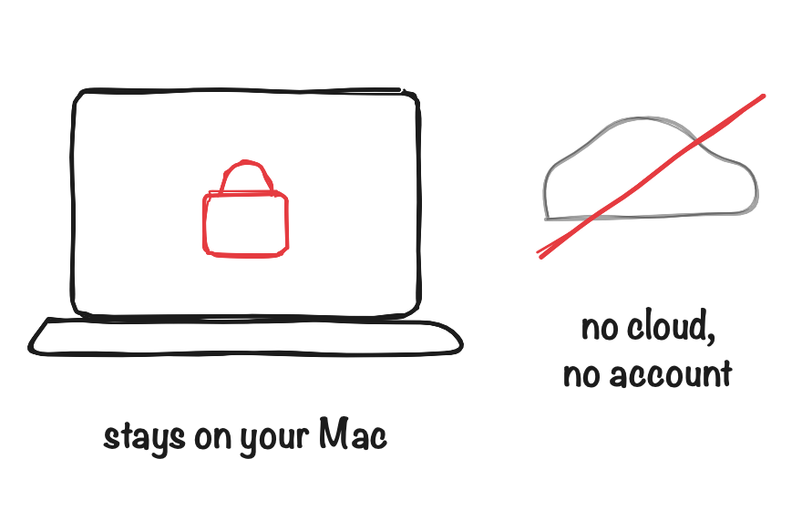
      </picture>
    </td>
    <td width="50%">
      <h3>Nothing leaves your Mac</h3>
      
No account, no cloud, no upload. Recordings are plain video files in your Movies folder, and they are yours.

    </td>
  </tr>
</table>

 

<h2 align="center" id="install">Install</h2>

<table>
  <tr>
    <td width="25%" align="center">
      <picture>
        <source media="(prefers-color-scheme: dark)" srcset="docs/images/install-1-dark.png">
        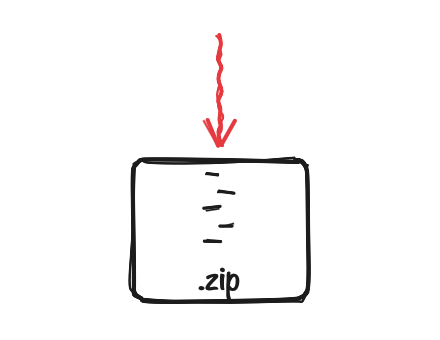
      </picture>
       <b>1.</b> <a href="https://github.com/alexanderpuschkinberlin/Mac-Monologue/releases/latest/download/Mac-Monologue.zip">Download</a> and open the zip.
    </td>
    <td width="25%" align="center">
      <picture>
        <source media="(prefers-color-scheme: dark)" srcset="docs/images/install-2-dark.png">
        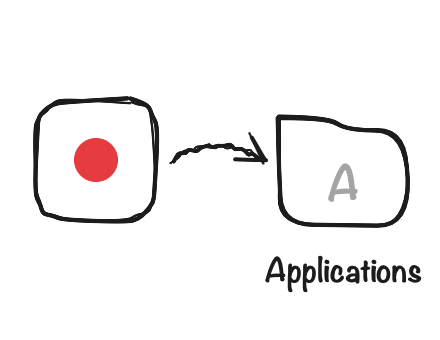
      </picture>
       <b>2.</b> Drag Mac-Monologue into your <b>Applications</b> folder. Opened from Downloads, it offers to move itself.
    </td>
    <td width="25%" align="center">
      <picture>
        <source media="(prefers-color-scheme: dark)" srcset="docs/images/install-3-dark.png">
        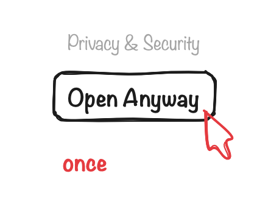
      </picture>
       <b>3.</b> Open it. When macOS stops it, choose <b>Open Anyway</b> - once.
    </td>
    <td width="25%" align="center">
      <picture>
        <source media="(prefers-color-scheme: dark)" srcset="docs/images/install-4-dark.png">
        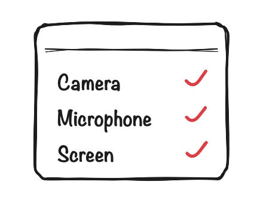
      </picture>
       <b>4.</b> The welcome steps set up camera, microphone and screen.
    </td>
  </tr>
</table>

<h4 id="first-open">The first time you open it</h4>

macOS stops the app with **“Mac-Monologue.app” Not Opened** and says Apple could not
verify that it is free of malware. That is expected: Apple only vouches for apps whose
developers pay a yearly registration, and Mac-Monologue is free. To open it:

1. Click **Done** - not *Move to Trash*.
2. Open **System Settings › Privacy & Security** and scroll to the bottom.
3. Next to *“Mac-Monologue.app” was blocked*, click **Open Anyway**, and confirm with
   your password or Touch ID.

You only do this once. Apple explains the same steps in
[Open a Mac app from an unknown developer](https://support.apple.com/guide/mac-help/open-a-mac-app-from-an-unknown-developer-mh40616/mac).

#### Camera, microphone and screen

The welcome steps ask for each permission in turn. Screen recording is only needed when
you record your screen, and the app restarts once after you allow it.

After an update, or when you install a new version by hand, macOS asks once more for
the camera and the microphone - click **Allow**. Screen recording stays allowed.

### Updates

Mac-Monologue tells you when a new version is out, shows what changed, and
installs it with one click. It checks with GitHub once a day - you can switch that
off in Settings. After an update, macOS asks once more for the camera and the
microphone.

## Questions

<b>Why does macOS warn me the first time I open it?</b>

 
Apple only lets apps through without asking once the developer has paid for a
yearly registration. Mac-Monologue is free and not registered, so macOS asks you to
confirm once in <i>System Settings › Privacy & Security</i> - see
<a href="#first-open">The first time you open it</a>. After that it
opens normally, and updates from inside the app do not ask again.

<b>Where are my recordings?</b>

 
In your <b>Movies</b> folder, under <b>Monologue</b>, named by date and time. After
each take, <i>Reveal in Finder</i> takes you straight to the file.

<b>How big are the files?</b>

 
You choose, in the main window or in Settings. For ten minutes, picture and sound together:

| Quality | Size | Good for |
|---|---|---|
| Economical | about 35 MB | email, slow connections |
| Medium *(standard)* | about 75 MB | most things |
| High | about 100 MB | crisp text, sharing as a link |
| Very high | about 300 MB | editing, big screens |

A still slide takes less, a lot of movement a little more.

<b>Why does it want to record my screen?</b>

 
Only when you record your screen - <b>Screen</b>, <b>Screen + Camera</b> or <b>Screen &amp; Head Touch Cut</b> - and only while you are recording. If you only ever
record yourself, you can skip that step. Mac-Monologue never records its own window.

<b>It does not see my camera, microphone or screen.</b>

 
Check <i>System Settings › Privacy & Security › Camera</i> (and <i>Microphone</i>, and
<i>Screen & System Audio Recording</i> for your screen) and switch on Mac-Monologue.
An iPhone used as a camera needs to be nearby and unlocked.

<b>Can I change the shortcuts?</b>

 
Yes, in <i>Settings › Shortcuts</i> - the drawing there shows where your fingers go.

<b>The video I play drowns out my voice.</b>

 
Slide the fader under the preview towards <b>Voice</b> - the Mac gets quieter, your
voice stays as it is. It works while you record, too. Or switch on <i>Lower Mac sound
while I talk</i>, next to the fader or in <i>Settings › Recording</i>, and the Mac gets
quieter whenever you speak.

<b>Can I turn off the countdown?</b>

 
Yes, in <i>Settings › Recording</i>: off, three, five or ten seconds.

<b>How do I remove it?</b>

 
Drag Mac-Monologue from Applications to the Trash. Your recordings stay in your
Movies folder.

 

---

<b>Where it comes from.</b> Mac-Monologue is a fork of
<a href="https://github.com/omacom/monologue">omacom/monologue</a>, David Heinemeier
Hansson's webcam recorder for Omarchy, rewritten from scratch in Swift for the Mac -
because a Mac is where I have the best camera and microphone. What was kept and what
changed is in <a href="DESIGN.md">DESIGN.md</a>.
  
<b>For developers:</b> building, testing and releasing are in
<a href="DEVELOPMENT.md">DEVELOPMENT.md</a>.
  
MIT licensed - see <a href="LICENSE">LICENSE</a>.

