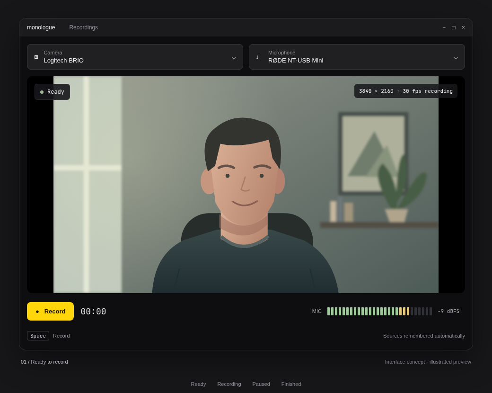
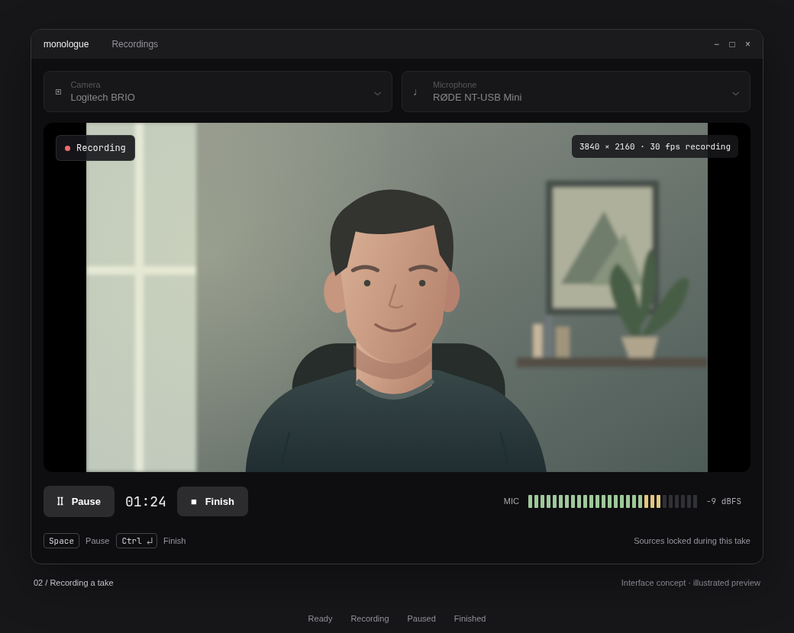
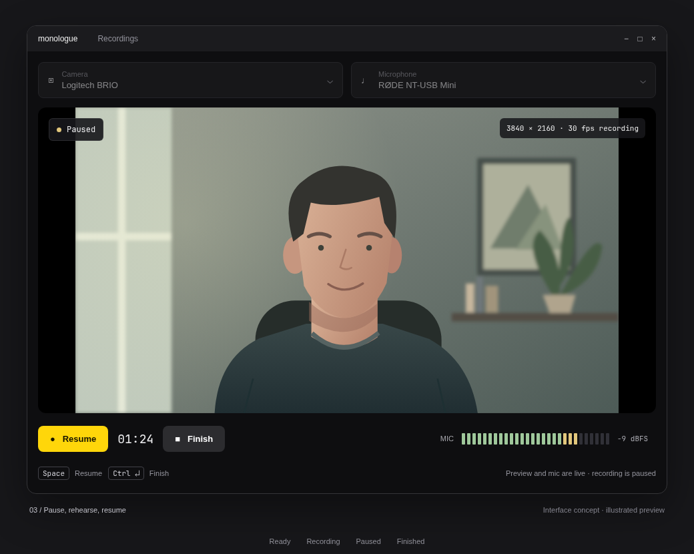
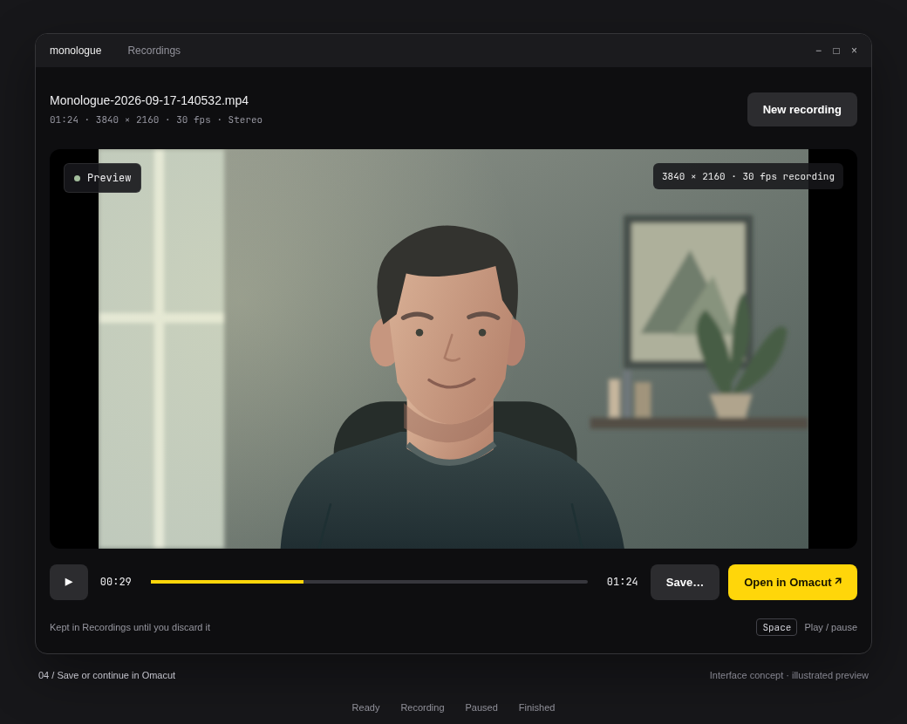

# Monologue — webcam recording with one key

Proposal, September 17, 2026. Deliverable: an implementation plan and rendered interface concepts, not a working recorder. Monologue is the working name, taken from this repository.

Open Monologue and see your camera immediately. Pick a camera and microphone once; subsequent launches restore both. Press **Space** to record, again to pause, and again to resume the same clip. Press **Finish**, then **Open in Omacut** or **Save…**. Record at the camera's maximum advertised video resolution automatically.

## Interface

Follow the sibling Omacut app: Qt Quick, Material Dark, near-black `#0e0e10` window, 16 px margins, 12 px preview corners, compact controls, monospaced duration, and the current Omarchy accent with a contrasting foreground. Use Omacut's yellow fallback when no theme is available. Start around 960 × 680 and remain usable at 640 × 460. Preserve the source aspect ratio with letterboxing; never crop the recording to fit the window. No sidebar, timeline editor, onboarding, or separate settings screen.

These screenshots are rendered HTML/CSS interface concepts with an illustrated camera placeholder. They show intended layout and copy, not captured application behavior. The native implementation will use QML.

### Ready

Two source selectors above the preview; the active capture format appears inside the preview. Below it: Record, recorded duration, and the selected microphone's meter. “Space to record” explains the primary action. Source changes apply immediately and persist after successful activation. Source labels may elide visually but show their full names in tooltips.

### Recording

The preview stays live. A red dot plus “Recording” makes the state explicit without relying on color. The Record control becomes Pause; Finish is available. Source selectors are locked for the entire take, including pauses, so one clip cannot silently change devices or format.

### Paused

The camera and audio meter remain live for rehearsal. The recorded duration freezes, and neither video nor audio from the pause enters the clip. “Space to resume” continues the same take. Finish also works here.

### Finished

Replace the live view with clip playback and a simple seek bar. Release camera and microphone; replace the input meter with clip metadata. Show **Save…** and **Open in Omacut** as peer actions, with Omacut highlighted. **New recording** returns to the remembered sources. Space now toggles playback. Display “Kept in Recordings until you discard it” so the clip's status is clear.

## Interaction contract

| State | Space | Finish / Ctrl+Enter | Sources |
| --- | --- | --- | --- |
| Starting / device unavailable | No action | Disabled | Available |
| Ready | Start a take | Disabled | Available |
| Recording | Pause this take | Finalize | Locked |
| Paused | Resume this take | Finalize | Locked |
| Finalizing | No action | Disabled | Locked |
| Finished | Play / pause clip | No action | Replaced by clip actions |

Ignore key auto-repeat. Shortcuts are window-local and inactive while a selector popup, text field, save dialog, or confirmation is active. Buttons have accessible labels and visible focus. A focused button receives Space normally without also triggering the application shortcut. During asynchronous start/pause/resume/stop transitions, disable conflicting actions and show a truthful transitional status until the backend acknowledges it. Never show Paused if recording is still running.

Ctrl+S opens Save only for a finalized clip. Closing during a take offers Finish and keep, Keep recording, or Discard; do not delete a take without explicit discard. Closing a finished unsaved clip retains it for recovery. New recording retains the previous clip and starts a fresh take; it never overwrites it. Escape dismisses dialogs, never discards a recording.

## Sources and automatic quality

- Enumerate the available camera and audio input devices. First launch selects the system defaults, then opens preview and input metering automatically. Include an explicit **No audio** choice for silent capture; do not substitute this for a failed microphone.
- Persist opaque device IDs and display labels in `QSettings`; persist No audio separately. Never persist list indices. Re-enumerate formats on each launch, including after reconnection. Remember the last save directory as well.
- If a remembered source is absent, retain its selection with “Unavailable” and ask the user to choose an available source inline. Do not silently activate another camera or microphone. Reconnecting the same identifiable source restores readiness, but never restarts a take. Duplicate labels must be disambiguated; a changed ID requires a new selection.
- Rank advertised video formats by pixel area, largest first. At the maximum resolution, prefer a format whose advertised range includes 30 fps and target 30 fps for encoded output; otherwise target the closest supported rate, preferring the lower rate on a tie. Qt cameras attempt the selected format’s maximum frame rate, so a range containing 30 does not guarantee capture at 30. Verify actual capture cadence and encoded rate in the spike; distinguish them in diagnostics and label the UI rate as the recording rate. See [Qt frame-rate behavior](https://doc.qt.io/qt-6/qcameraformat.html#maxFrameRate-prop). Resolve remaining pixel-format ties by proven backend compatibility. Resolution takes priority over frame rate: a camera's 4K/15 mode wins over 1080p/60. Do not use still-photo resolution or upscale.
- Configure capture and encoder output to the selected dimensions explicitly. Display the negotiated dimensions and frame rate, and verify the encoded result. If maximum resolution cannot be opened or encoded, explain that failure; do not silently record a lower resolution. Try compatible pixel formats at the same dimensions before reporting failure.
- Device busy, denied permissions, no camera, and microphone failure each get an inline explanation and Retry / source selection. Disable recording until selected inputs are healthy. A lost device during a take stops capture and preserves whatever can be finalized; label the clip interrupted. No automatic source replacement or automatic resume.

## Audio meter

Show a horizontal segmented peak meter for the selected input in Ready, Recording, and Paused. Compute the maximum absolute sample across channels from the same PCM stream supplied to the encoder. Display −60 to 0 dBFS; use green below −12, amber above −12, and red near −3 dBFS, with a one-second clip indicator at full scale. Smooth the decay, hold the peak briefly, and update the UI around 25 Hz. Add a textual level and “No signal” after sustained silence; silence itself must not prevent recording. With No audio selected, show “Audio off.” Do not play microphone audio through speakers. System mixer controls handle gain in v1.

## Capture and output design

Use the same C++17 / Qt Quick / qmake structure as Omacut, with QML embedded into a single executable. Keep device discovery, recording state, PCM metering, settings, and clip files in C++; QML presents state and sends commands. Read Omarchy's accent using the same theme watcher approach as Omacut. Reuse its portal save-dialog pattern and preserve required license attribution for copied code.

Start with `QCamera` → `QMediaCaptureSession` → `QMediaRecorder`, with a `VideoOutput` preview. Qt exposes camera format resolution and frame-rate ranges through [QCameraFormat](https://doc.qt.io/qt-6/qcameraformat.html). Capture-session wiring is documented in [QMediaCaptureSession](https://doc.qt.io/qt-6/qmediacapturesession.html).

For one shared microphone stream, prototype `QAudioSource` → PCM meter → `QAudioBufferInput` on the recording session. This input is available from Qt 6.8 and requires Qt's FFmpeg backend; use that as the initial minimum/backend requirement. Feed bounded buffers according to readiness, and surface overload instead of growing a queue indefinitely. See [QAudioBufferInput](https://doc.qt.io/qt-6/qaudiobufferinput.html). Do not open a second microphone stream solely for metering.

**Prove pause/resume and A/V synchronization before building the full UI.** Qt's [QMediaRecorder](https://doc.qt.io/qt-6/qmediarecorder.html#pause) documents that pause support depends on the platform; high-resolution encoding can also drop frames. Verify pause acknowledgement, correct audio-buffer timestamps, no queued paused audio, bounded backpressure, and synchronized resume on the target Linux backend. Prefer native pause only once demonstrated. If it fails, record separately finalized segments with identical settings, discard paused PCM, and concatenate them using ffmpeg at Finish; validate joins and normalize timestamps without adding gaps. This fallback must pass the same synchronization checks before proceeding.

Target MP4 with H.264 video and AAC audio (omit the audio track for No audio), keeping native dimensions and a high-quality encoder preset. Probe codec/backend availability before enabling Record; do not substitute an unreadable format silently. Prefer supported hardware encoding, with software encoding at the same resolution if sustainable. Establish quality and sustainable throughput in the capture spike rather than guessing a universal bitrate.

Record into an app-owned per-take directory under the XDG data location (`monologue/recordings/<unique-id>/`), with metadata and an in-progress marker. Stream to disk. Do not use a temporary directory that may disappear while Omacut is still reading the file. Finalize asynchronously; keep actions disabled until output is closed and `ffprobe` confirms valid streams, dimensions, and duration. Only then show Finished. A crashed, unfinalized MP4 may not be recoverable: retain partial files and report their status honestly. On launch, show a nonmodal Recordings badge for retained completed takes and interrupted ones; do not silently delete them. Always enter Ready with the remembered sources when healthy: recovery must not block preview or the first Space press. Open the recovery list only when requested. Disk-full and write errors preserve existing data and offer retry where possible.

**Save…** uses a portal dialog, suggests `Monologue-YYYY-MM-DD-HHMMSS.mp4`, and remembers the directory. Copy the finalized clip to a temporary sibling of the chosen destination, then atomically rename after successful close; honor overwrite confirmation. Cancel/failure retains the original and keeps Finished visible. Save is a copy, not a re-encode.

**Open in Omacut** starts `omacut` with the absolute finalized path as one process argument, without a shell. This is supported by the sibling app's `src/main.cpp`. It requires no prior save dialog. Keep the underlying recording even after Monologue exits; a successful launch does not prove Omacut has finished reading it. If Omacut is missing or fails to start, show an actionable message and leave Save available. Explicitly discarded files are the only files deleted in v1; warn before discarding a take handed to Omacut. A visible Recordings entry gives access to retained takes and their disk usage, using a small list/dialog rather than a permanent library sidebar.

## Implementation sequence

1. **Capture spike:** discover sources, restore IDs, choose maximum resolution, record with the shared PCM meter, pause/resume repeatedly, finalize MP4, and open it in the installed Omacut. Compare native pause and segment fallback if necessary. Record tested Qt/backend/encoder versions and device formats. This is the gate for the proposed architecture.
2. **Native window:** implement the state machine, preview, selectors, themed controls, meter, duration, keyboard behavior, and device errors. Match the supplied concepts and verify at minimum window size.
3. **Clip lifecycle:** persistent take storage, Finish, playback, portal Save, direct Omacut launch, recovery list, disk errors, and safe discard/close behavior.
4. **Ship:** focused backend tests plus real-device checks, `bin/build` / `bin/test` / `bin/install`, desktop entry, icon, Arch package dependencies, and a short README covering shortcuts and storage.

## Acceptance checks

- Select non-default camera and mic, quit, and reopen: both return with live preview/meter and no setup clicks. Reorder devices and reconnect; selections must not follow indices. Missing devices never silently change the source.
- Use a camera advertising competing resolutions/frame rates; confirm `ffprobe` reports the maximum video dimensions and chosen supported frame rate. Verify portrait and 4:3 sources are not cropped or stretched.
- Record 5 seconds, pause 10, resume 5, then Finish: output is approximately 10 seconds, contains no paused material, and plays correctly in Omacut. Repeat rapid pauses and test Finish while paused. Use audible claps with visible hand contact across joins and a 30-minute take to detect drift (target under 80 ms).
- Verify microphone changes affect both meter and recorded sound, peak/clipping indication, no speaker monitoring, and explicit silent recording. Keep buffering bounded at maximum resolution; exercise encoder overload and audio backpressure.
- Unplug each source, deny access, fill storage, fail finalization, and close during a take. Confirm truthful status, retained data, disabled invalid actions, and recoverable completed takes after restart. Do not promise recovery of corrupt partial media.
- Save cancellation, unwritable destination, overwrite decline, filenames with spaces, and Omacut missing/start failure all leave the clip available. Open in Omacut, close Monologue, and verify the editor can still read the clip.
- Check Space with focused controls, dropdowns, dialogs, held keys, and asynchronous transitions. Verify keyboard navigation, readable theme contrast, and the 640 × 460 layout.

## Scope

Linux/Omarchy first; one camera, one audio input, one take at a time. No screen recording, effects, virtual backgrounds, streaming, trimming, or codec/quality settings. Omacut handles editing. Hardware behavior and the proposed audio/pause path remain implementation validation gates, not claims established by these mockups.

## References and review

Visual and integration references inspected locally: `../omacut/README.md`, `src/Main.qml`, `src/main.cpp`, `src/backend.cpp`, `src/portalfilepicker.cpp`, and `omacut.pro`. Review findings and resolutions are recorded in [codex-review.md](codex-review.md). Editable concepts: [mockups.html](mockups.html).
